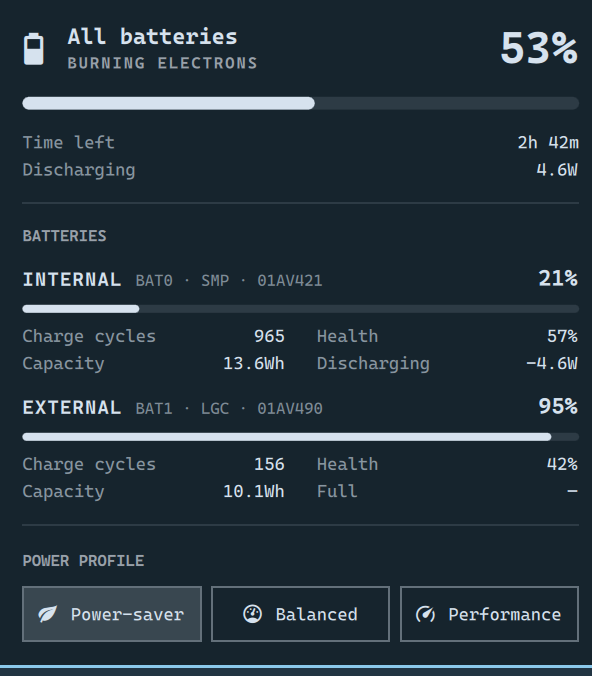

# Power (Multi-Battery)

A drop-in replacement for Omarchy's built-in power widget that treats each battery as its own
cell instead of collapsing the machine to one.



## Why

Omarchy's battery status reads a single device:

```bash
battery=$(upower -e | grep BAT | head -n 1)
```

Everything downstream of that line describes one cell while claiming to describe the laptop.

Charge level and power draw at least *have* an aggregate, so they can be fixed by reading UPower's
`DisplayDevice` instead. **Charge cycles, capacity and health cannot.** They are facts about a
physical cell, and there is no meaningful way to sum them — the only honest fix is to stop
pretending the machine has one battery.

On the ThinkPad T480 this was written for, the two packs are nowhere near each other:

```
BAT0  Internal  SMP 01AV421   965 cycles   13.6Wh of 24.0Wh design   57% health
BAT1  External  LGC 01AV490   156 cycles   10.1Wh of 23.9Wh design   42% health
```

The stock widget reports `965` as *the* cycle count. Swap which pack the kernel enumerates first
and the same machine reports `156`. Neither is wrong about a battery; both are wrong about the
laptop.

The charge level goes wrong the same way. With the internal pack at 21% and the external at 95%,
`DisplayDevice` puts the machine at 53% with 2h 42m left — the stock read reports **21% and 38m**,
because that is all BAT0 knows.

This plugin takes the machine-wide figures from UPower's aggregate device and gives every battery
its own card, so the aggregate stays aggregate and the per-cell facts stay per-cell.

## Install

```bash
omarchy plugin add https://github.com/alhasapi/omarchy-power-multibattery.git --enable
```

Enabling it takes the built-in power widget's **exact slot** in your bar — same section, same
position, nothing to rearrange. To go back:

```bash
omarchy plugin disable alhasapi.power
```

That restores the original widget to the same slot. The two are mutually exclusive by design;
you will never end up with both.

## Hardware

Works on any battery count, on any laptop.

| Machine | Cards |
|---|---|
| Two-battery ThinkPad (Power Bridge: T480, T470, and relatives) | **Internal** / **External** |
| Any other multi-battery machine | **Battery 1** … **Battery N** |
| Single battery | **Battery** |
| No battery | The panel falls back to the stock behaviour |

The Internal/External naming comes from DMI — Lenovo's Power Bridge always enumerates the
built-in cell as `BAT0` and the hot-swappable one as `BAT1`. That is the only two-battery layout
that can be named with confidence, so everything else gets ordinals rather than a guess.

Bluetooth peripherals are excluded. UPower enumerates a paired mouse or headset under the same
`battery_` prefix as the machine's own cells, so the prefix alone is not a filter — the cards are
selected on UPower's `power supply` flag, the same test the panel itself applies. A paired mouse
cannot turn "Battery" into "Battery 1" or take an ordinal away from a real pack.

## How it works

The live values — percentage, state, draw, time remaining — come from UPower through Quickshell,
per device rather than through the aggregate `displayDevice`.

`bin/battery-details` covers what Quickshell's UPower QML API does not expose: charge cycles and
the charge start/stop thresholds, plus vendor and model so a cell is identifiable at a glance. It
falls back to `/sys/class/power_supply` for cycles and thresholds where UPower reports nothing,
which is common on older firmware.

## Credits

Derived from Omarchy's first-party `omarchy.power` plugin, MIT, © 37signals.

The underlying bug has been reported upstream more than once —
[#5780](https://github.com/basecamp/omarchy/issues/5780),
[#7214](https://github.com/basecamp/omarchy/issues/7214) — and
[#5958](https://github.com/basecamp/omarchy/pull/5958) by @stefanomainardi and
@Michael-Steshenko was an earlier attempt at fixing the aggregate half of it.

MIT. See [LICENSE](LICENSE).
